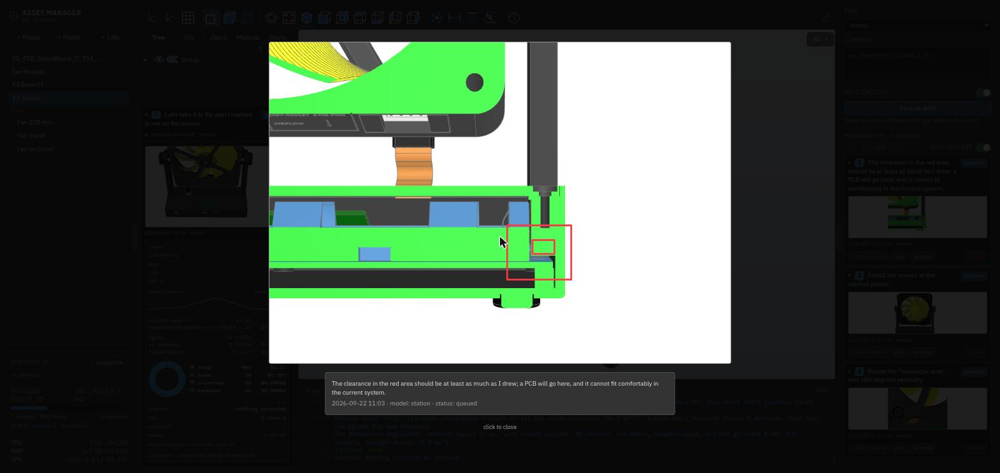

<div align="center">

# X3 Studios Asset Manager

**Open a parametric CAD model in the browser, freeze an angle, draw on it,
leave a revision note.** All project data lives in MongoDB.

</div>


Models can be built from other models, so an assembly is just a module that
imports its parts and positions them. The fit is then checked in code rather
than by eye — the module below reports its own pivot alignment, engagement
length and clash volumes on every build:


## What it solves

Talking about a CAD revision is awkward: "chamfer that corner" — which corner,
by how much? This tool makes the conversation concrete. You orbit the model,
freeze the angle you want, mark it with a red pen and type your note. The
record is stored together with the marked-up image, the camera angle, the
selected part and the model name.

Revisions start as **drafts**. Until you press *queue*, `GET /api/queue`
returns nothing — so a teammate or a language model only ever sees what you
have approved.

## Stack

| Layer | Technology |
|---|---|
| Model | Python 3.12 + [build123d](https://github.com/gumyr/build123d) (OpenCascade) |
| Tessellation | `ocp_vscode` / `ocp-viewer-core` |
| Viewer | [three-cad-viewer](https://github.com/bernhard-42/three-cad-viewer) 5.0.6 — the very viewer the VS Code extension uses |
| Frontend | Angular 20 + Tailwind CSS 4 |
| Service | FastAPI + Uvicorn |
| Data | MongoDB + GridFS |

## Where the data lives

Nothing project-related is kept on disk. A temporary directory is created while
a model is built and removed as soon as the build finishes.

| Collection | Contents |
|---|---|
| `models` | model source code, title, sha256, generated-artifact references |
| `folders` | catalog folders |
| `revisions` | comment, camera, part, status, queue timestamp |
| `model_versions` | version history (latest + 10), source text only |
| `model_files` (GridFS) | generated viewer JSON / STEP / STL, gzipped |
| `shots` (GridFS) | marked-up revision images |

Version history deliberately stores **source code only**: viewer, STEP and STL
are derived artifacts and are rebuilt after a rollback. That keeps history in
kilobytes rather than megabytes.

## Setup

Requirements: **Python >= 3.10**, **Node >= 20.19**, a MongoDB connection
(Atlas or local).

```bash
git clone https://github.com/x3beche/x3-studios-asset-manager.git
cd x3-studios-asset-manager
cp .env.example .env          # fill in MONGODB_URI
./start.sh
```

On first run `start.sh` creates the virtual environment, installs npm
dependencies and starts both servers with live reload:

- UI <http://127.0.0.1:4200>
- API <http://127.0.0.1:8000>

Single-server production build: `./start.sh --build` &rarr; `:8000` only.

The connection string is read by the backend alone and never reaches the
frontend. `.env` is git-ignored.

| Variable | Default | What it does |
|---|---|---|
| `MONGODB_URI` | — | required; the database is the source of truth |
| `MONGODB_DB` | `assets_3d` | database name |
| `OPENROUTER_API_KEY` | — | card summaries; without it a card simply has none |
| `X3_BUILD_MEM` | `6G` | memory ceiling a build may use before it is killed |
| `X3_CACHE` | `.cache/artifacts` | where generated artifacts are kept on disk |

## Working with language models

Two files are aimed at models opening this repository:

- **`AGENTS.md`** — the summary to read first
- **`.claude/skills/asset-revisions/SKILL.md`** — a Claude Code skill that
  triggers on requests like "what's queued" or "apply what I drew"

Because revisions live in the database, a model can see pending requests the
moment it opens the project:

```bash
.venv/bin/python tools/revisions.py queue    # queued requests
.venv/bin/python tools/revisions.py show ID  # write the marked image to disk
.venv/bin/python tools/revisions.py source fan_pro > /tmp/m.py
.venv/bin/python tools/revisions.py save fan_pro /tmp/m.py
.venv/bin/python tools/revisions.py build fan_pro
.venv/bin/python tools/revisions.py done ID
.venv/bin/python tools/render.py ID          # render from the drawing's camera
```

Every revision stores the camera it was drawn from, so the result can be
photographed from the same viewpoint. `?rev=<id>` in the URL opens the model
at that camera too.

The tool talks to MongoDB directly, so it works with the server stopped. Only
**queued** revisions count as work; drafts stay invisible.

While working, a model can report progress to the screen — a bar at the top and
a log at the bottom:

```bash
.venv/bin/python tools/revisions.py start ID "what you are doing"
.venv/bin/python tools/revisions.py log "reading source" -p 20 -l work
.venv/bin/python tools/revisions.py finish
```

## Usage

1. Create a model with **+M** in the left column. A skeleton is generated.
2. Write the model, build it with **↻** (build123d runs, the result goes to the
   database).
3. Click the model to open it in the viewer, or open one directly with
   `?model=<name>`. **Double-click a part** and the form on the right fills
   itself in.
4. **Freeze and draw** &rarr; mark it up &rarr; write the comment and save.
   Seven tools: freehand, line, arrow, rectangle, ellipse, triangle and text.
   Text is typed where you click, not in a dialog, so you can see what you are
   labelling. Saving releases the freeze.
5. Press **queue** when it is ready. Click the card thumbnail to enlarge it.

A comment about a part is a revision on its own — freeze and draw is optional.
When a run finishes, a notice appears in the top-right corner and the camera
swings to the angle the revision was drawn from; the notice stays until it is
dismissed.

The viewer's **Clip** tab cuts the model on three planes, which is how the
inside gets inspected without exporting anything.

A single button on the card cycles the status: draft &rarr; queued &rarr;
applied &rarr; draft. So "applied" can be undone. **edit** changes the comment
and the part; the drawing itself is the record and stays as it was.

Clicking a card's thumbnail opens the drawing full size, with the comment,
part, model and status underneath:



### Model contract

A module must define the following to appear in the catalog:

```python
TITLE = "Fan 120 mm"                    # optional, shown in the UI
PARTS = [frame, rotor, pins]            # build123d objects to tessellate
NAMES = ["housing", "impeller", "pins"] # optional, names in the tree
```

### Card summaries

A card holds whatever the person typed while looking at the model, which is
usually long. Folded, it shows one sentence instead:

```
▸ 1  Fanın iki yüzündeki yuva derinliklerini yarıya indir        QUEUED
```

Nothing else — no drawing, no date, no buttons. Opened, the sentence sits
above the full text marked **◆** when generated and **✎** when written by
hand.

The sentence comes from an LLM that is given the text *and* the drawing,
because the text leans on the drawing: "bu kısım", "bu yazı" only mean
something next to the red marks. The call is made by the server; the key
never reaches the browser.

| | |
|---|---|
| Service | OpenRouter, `deepseek/deepseek-v4.1-flash` |
| Key | `OPENROUTER_API_KEY` in `.env` (gitignored) |
| Request | `max_tokens` 60, `temperature` 0.2, reasoning off, 15 s timeout, 2 retries with backoff |
| Image | long edge scaled to 512 px, sent as a JPEG data URL |
| Cost | ~0.00018 USD per card measured over 15 cards; warns above 0.005 |

The system prompt is byte-identical on every request so the provider can
cache the prefix. A reply is trimmed to one line and stripped of quotes and
an "Özet:" prefix; over 12 words it asks once more and then keeps whatever
came back rather than cutting a sentence in half.

Generated when a card is created and when its text changes. It runs off the
request, so a slow or failed call never holds up saving, and it never
replaces a sentence someone wrote by hand — clearing the field in **edit**
hands the card back to the generator.

```bash
.venv/bin/python tools/revisions.py summaries            # backfill
.venv/bin/python tools/revisions.py summaries --all      # redo every card
.venv/bin/python tools/revisions.py summaries --force    # replace hand-written
.venv/bin/python -m pytest tests -q --asyncio-mode=auto  # 26 tests, no network
```

### The left column

Hovering a row shows what can be done with it: a model has **&rarr;** (move),
**↻** (rebuild) and **&times;** (delete), a folder has **+M**, **+K** and
**&times;**.

Deleting takes two clicks — the first arms the row, the second does it. No
dialog: a `confirm()` freezes the page and cannot be driven in a test.

An assembly imports the parts it is made of, so deleting one of those parts
breaks its build the next time it runs, with a traceback and no clue why. The
server checks who imports a model before removing it and refuses:

```
base is imported by station; deleting it breaks their build.
```

The UI offers the override rather than hiding it.

Moving is two clicks rather than a drag — press **&rarr;** on the model, then
click the folder, or *to root* in the strip that appears. A folder deletes
only when it holds nothing; the server refuses otherwise and says so.

A model's id carries its folder, so moving one renames it and its revisions
follow. Assemblies keep working: during a build every model is also written
under its bare name while that name is unambiguous, so `import stand` still
resolves after `stand` moves into `parts/`.

### Bringing in a CAD file

**+ CAD** in the left column takes STEP, IGES, BREP, STL or 3MF. The file
goes to GridFS and the server writes a model that imports it, so it is in the
viewer without a second step:

```python
part = import_step(ROOT / "bracket.step")   # uploads land in the build root
PARTS = [part]
```

| Format | How it comes in |
|---|---|
| STEP / BREP | solids, exactly |
| IGES | surfaces — the generated module sews them and makes solids where the shells close |
| STL / 3MF | mesh; written back as STL, because a mesh saved as STEP is one face per triangle (a 660 kB 3MF became a 131 MB STEP) |

**Native CAD files cannot be read.** `.f3d`, `.sldprt`, `.ipt`, `.catpart` and
friends are each vendor's own database; no open reader exists. The upload says
so and names the export to use instead.

An imported solid **is not parametric**. It carries no feature history, so a
dimension cannot be dialled in — it can be cut, joined, filleted, measured and
placed in an assembly, and that is all. Colours survive the import.

| Endpoint | Purpose |
|---|---|
| `POST /api/uploads` | multipart; `make_model=false` to skip the generated model |
| `GET /api/uploads` | what has been brought in |
| `GET /api/uploads/{name}` | the file back |
| `DELETE /api/uploads/{name}` | remove it |

### Assemblies

Every model's source is written into the build directory, not just the one
being built, so a module can import the parts it is made of:

```python
import os
os.environ["X3_IMPORT_ONLY"] = "1"      # parts must not run their own exports
import fan_pro as F
import stand as D

PARTS = place(F.PARTS, ...) + place(D.PARTS, ...)
```

Guard exports and the `show()` call in each part with
`if STANDALONE:` (`STANDALONE = os.environ.get("X3_IMPORT_ONLY") != "1"`),
or importing one will drop its STEP and STL into the assembly's output.

## Keeping it quick

A viewer payload runs to tens of megabytes, and three things were making that
hurt:

| | |
|---|---|
| **Served as stored** | The payload is gzipped in GridFS and was being unpacked on the server for the browser to receive it uncompressed — 63 MB on the wire for a model that packs to under six. It now goes out with `Content-Encoding: gzip`. |
| **Cached on disk** | Generated artifacts never change, so they are kept under their GridFS id in `.cache/`. The build writes that copy too, so even the first read after a build is local. The database keeps the backup; the disk does the work. |
| **Stamped** | The payload is served `immutable`, so the URL carries the build time. Without it the browser keeps showing the build it cached however many times the model is rebuilt. |

```
station, 63.7 MB artifact
  before   63.7 MB on the wire, 100 s
  now       5.8 MB on the wire,  24 s first, 0.18 s after
```

Builds run under a memory ceiling with swap disabled (`tools/capped.sh`,
`X3_BUILD_MEM`, 6 GB by default). A model that imports a large STEP and
booleans against it can otherwise grow until the machine swaps and the
desktop freezes; with the ceiling the kernel kills the build instead and the
route reports it in words rather than a traceback.

## API

| Endpoint | Purpose |
|---|---|
| `GET /api/catalog` | folder + model tree |
| `PUT /api/models/{id}` | write source code |
| `POST /api/models/{id}/build` | tessellate, store output in the database |
| `GET /api/models/{id}/viewer.json` | viewer payload |
| `GET /api/models/{id}/file/{step\|stl}` | generated file |
| `POST /api/models/{id}/move?folder=` | move between folders (the id carries the path) |
| `DELETE /api/models/{id}?force=` | delete; refused while another model imports it |
| `POST /api/uploads` · `GET /api/uploads` · `DELETE /api/uploads/{name}` | bring in a STEP/IGES/BREP/STL/3MF |
| `POST /api/revisions/{id}/summary?force=` | regenerate the one-line summary |
| `GET /api/queue` | **queued revisions only** |
| `GET /api/revisions/{id}/image` | marked-up image |
| `PUT /api/revisions/{id}` | edit the comment and part (the drawing is immutable) |
| `DELETE /api/revisions/{id}` | delete a revision and its image |
| `POST /api/versions` · `POST /api/versions/{id}/restore` | snapshot / roll back |
| `GET /api/stats` · `GET /api/system` | database usage, CPU/RAM/GPU |
| `POST /api/activity` · `GET /api/activity` | the log shown at the bottom |
| `POST /api/run/start` · `POST /api/run/finish` · `GET /api/run` | the progress bar at the top |

## Gotchas

- **If WebGL is unavailable in Chrome** the viewer will not start. Chrome 137+
  removed the automatic software fallback. On hybrid Intel + NVIDIA machines
  `chrome://flags/#use-angle` &rarr; **OpenGL** fixes it; on the machine this
  was developed on, the default ANGLE backend could not create a GPU command
  buffer.
- `export_gltf` and tessellation calls **silently ignore** `linear_deflection`
  when the shape already carries a triangulation. Call `BRepTools.Clean_s`
  first.
- The `display.render(...)` example in the `three-cad-viewer` docs is
  misleading: `render()` lives on `Viewer`, and `resizeCadView` throws before
  the first `render()`.
- `Plane.rotated()` takes **global** angles, not local — assuming otherwise
  produces silently wrong geometry.
- Loft sections must be polygons; with ellipse wires OCCT fails to match
  sections and raises `NCollection_DataMap::Find`.
- `Compound(children=[...])` **reparents** its children, so building a helper
  compound detaches them from the previous one and corrupts the bounding box.
- A half-space prism built from two points **stops where the points stop**.
  Cutting "everything above this line" with a prism spanning only the line's
  own extent leaves material standing where the line ends — in this case a
  0.2 mm thin wall, 4 mm tall, running the width of the case. Extend the line
  past both ends.
- Waiting for a `canvas` element is not waiting for the model: the canvas
  exists within a second while a 50 MB payload takes most of a minute. Every
  screenshot taken that way came out empty.
- A plane built for a sloped face must have its **origin on that face**.
  Offsetting by the wall thickness from a plane that merely runs parallel puts
  the part slightly inside the wall, and the interference is small enough to
  look like a rounding error.

## License

MIT
