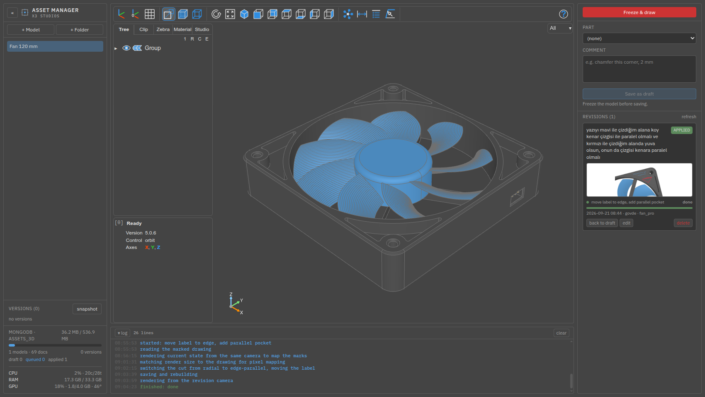
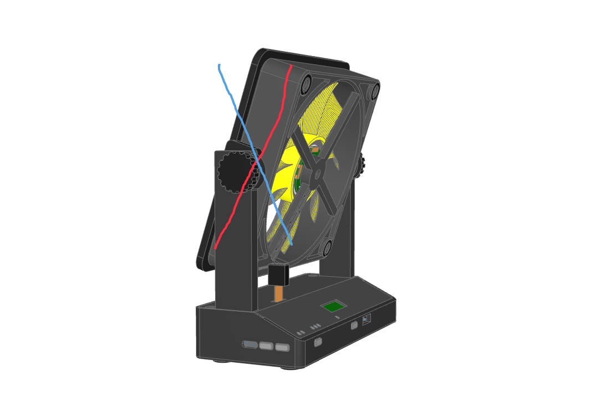
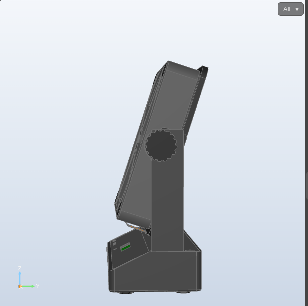
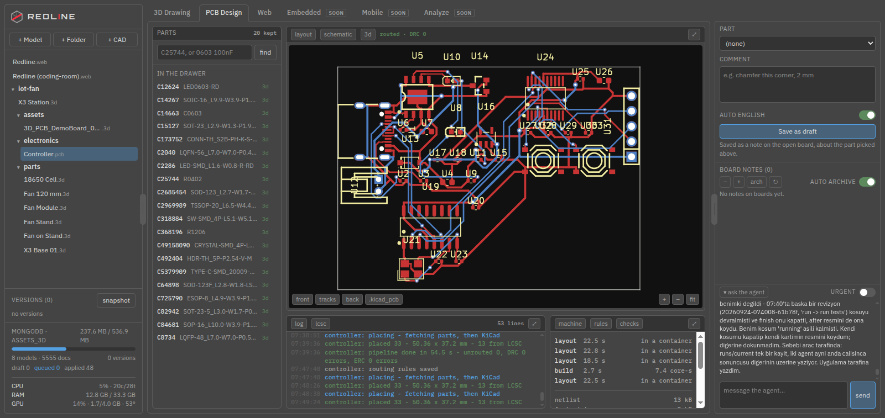
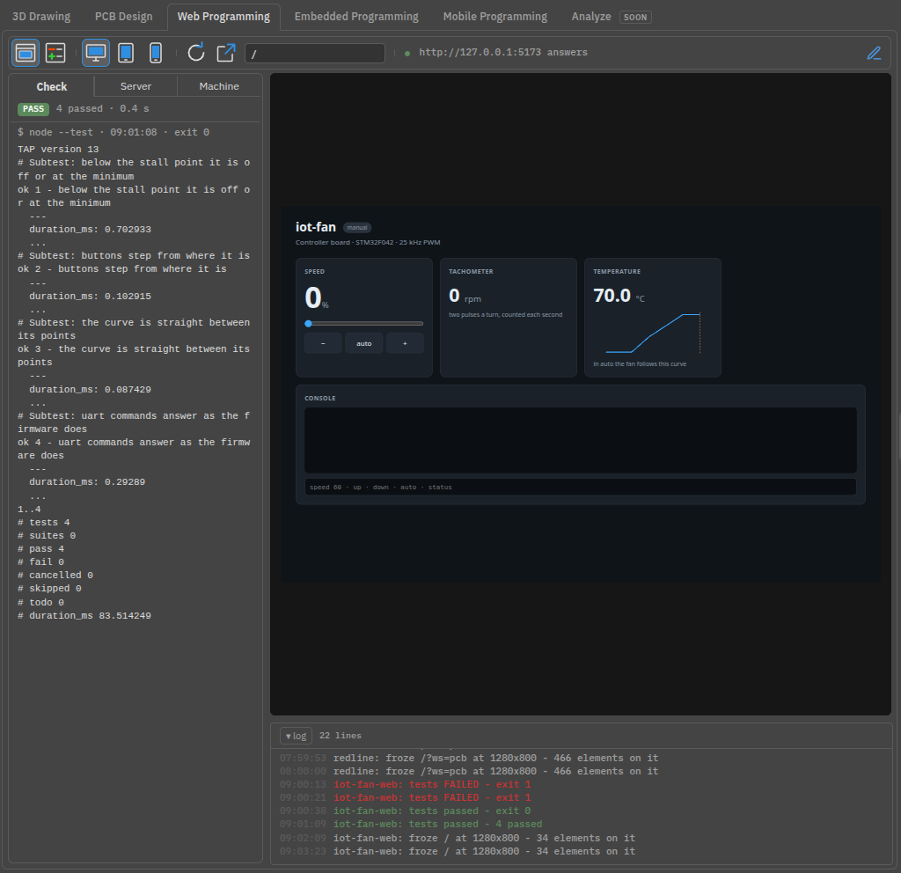
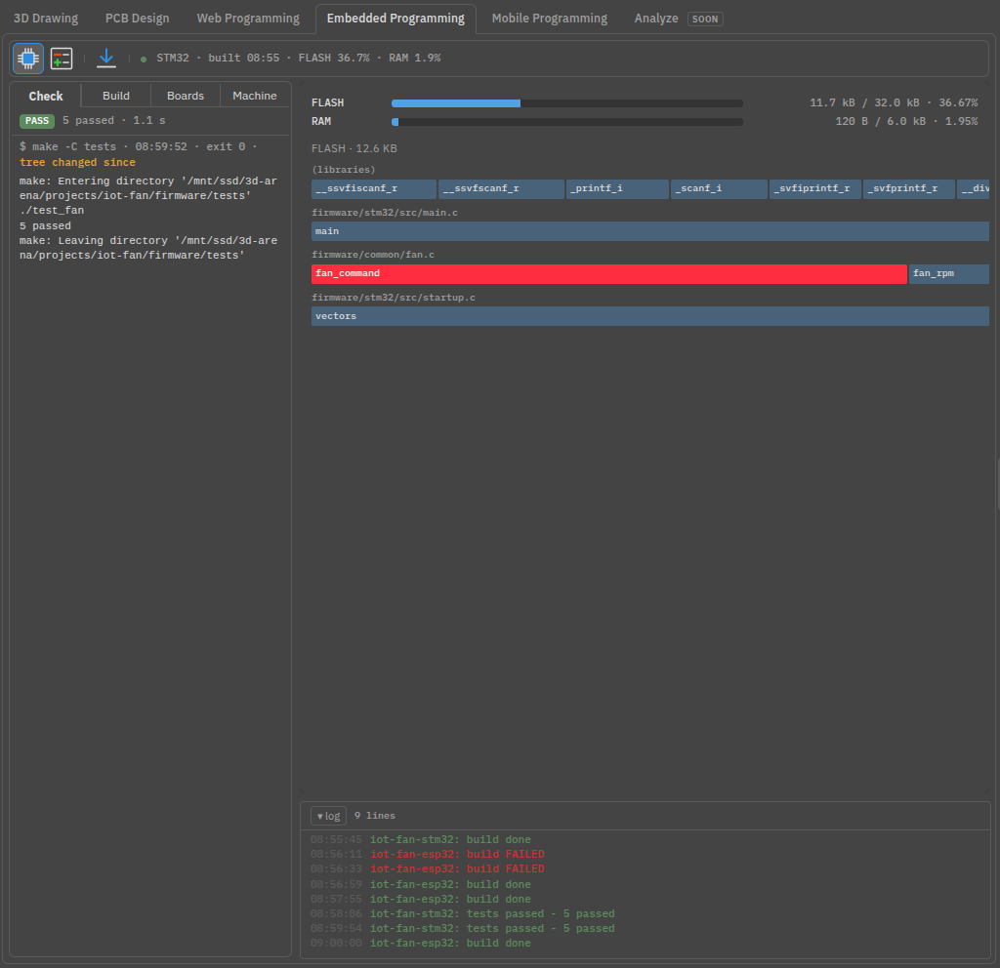
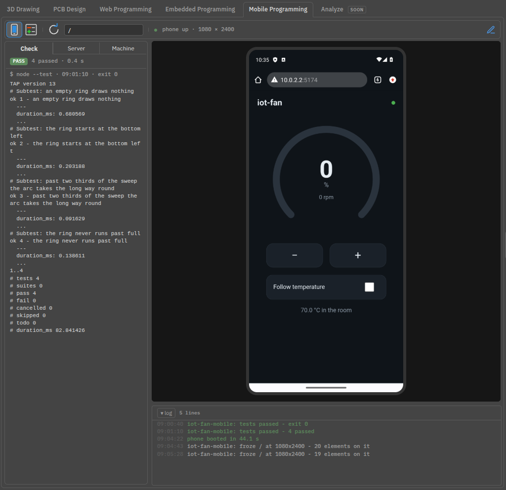
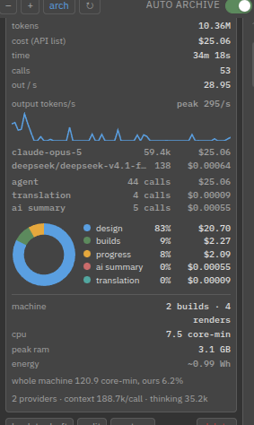
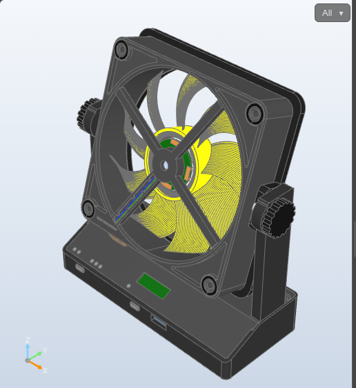

<div align="center">

# Redline

**Open a parametric CAD model in the browser, freeze an angle, draw on it,
leave a revision note.** All project data lives in MongoDB.

[Install](INSTALL.md) · [Usage](USAGE.md) · [For language models](AGENTS.md)

</div>



## What it solves

Talking about a CAD revision is awkward. "Tilt the fan the other way" — which
way, by how much, and from which viewpoint? Words alone lose the thing you
were looking at.

This tool makes the conversation concrete. You orbit the model, freeze the
angle you want, mark it with a pen and type the note. What gets stored is the
note **together with** the marked-up image, the camera, the parts that were
visible and the model name.

### A worked example

Someone wanted the fan to lean the other way. They froze the view, drew a red
line along the tilt it had and a blue line along the tilt it should have, and
wrote one sentence:

> The fan should not be like the red line, it should be slanted like the blue
> line; update the connector etc. accordingly.

| What was drawn | What came back |
|---|---|
|  |  |

The lines were measured off the image in pixels and projected back through the
stored camera: the red one matched the module's existing +18°, the blue one the
same angle mirrored. One constant changed:

```python
TILT = -18.0        # + : top toward the front, - : top toward the back
```

"Update the connector etc. accordingly" turned out to be the interesting half.
The plug was drawn where the socket sits on an **upright** fan, and the
assembly then tilted the fan without moving the plug — so at any tilt but
zero, the plug was hanging in mid-air. Now it rides the same rotation, and a
check in the assembly says so out loud:

```
fis <-> soket  : plug-shroud 0.00, plug-pins 0.00, plug-body 0.00 mm^3
               : cavity wall 14.3 mm^3  (must be > 0: the plug really is in the socket)
```

Zero clash on its own means nothing — a plug 18 mm away in open air also
clashes with nothing. The second line is the one that matters: a probe the
size of the socket cavity, grown slightly, has to *hit* the shroud around it.

## Four rooms, one loop

The loop under this is not about geometry. Source lives in a database as
text you can change a constant in; it is built into something you can look
at; you freeze a view, mark it and leave a note; an agent picks the note
up, edits the source, rebuilds, photographs it from the same angle and
checks it against a measurement. A board and a running interface fit that
as well as a solid does.

| | |
|---|---|
| **3D Drawing** | parametric solids — this is what is built |
| **PCB Design** | atopile for the circuit, LCSC for the parts, KiCad in a container for the board |
| **Web Programming** | a page while it runs: draw on it, the change arrives as a diff, the tests are the check |
| **Embedded Programming** | STM32 and ESP32 firmware: what the build made of the source, the change as a diff, programmed by the agent |
| **Mobile Programming** | an app on an emulated phone, redlined the way a page is |
| **Analyze** | what all of it cost, across every revision rather than one card at a time |

All but Analyze are built, and they share one layout - the 3D room's -
so a board, a page and a phone are looked at the same way. Analyze is a
tab with the groundwork written down, and says so.



The board room takes a circuit written as text, fetches each part from
LCSC by its number — footprint and 3D model together — and has KiCad
place and draw it inside a container, so a gigabyte of libraries never
lands on the machine. Out come a layer render, a model and a BOM.

The programming rooms redline a program while it runs. The pen takes a
real screenshot - of a page in a container's Chrome, of an emulated
phone's screen - and a ring or an arrow is laid on the elements under
it: "this button, in public/index.html", not "these pixels". Firmware has
no screen, so its view is what the build made of the source, and a note
is about a function picked there. Each comes back as a diff, with the
test suite or the build as the check and the same screen afterwards as
the after.



| | |
|---|---|
|  |  |

## Who does the work

One main agent watches the queue and the thread, and hands each note to
an agent for its room - 3D, board, web, embedded, mobile - which applies
it, checks it and closes it. Rooms work in parallel, each with its own
run, its own log and, for the three programming rooms, its own Docker
image, so nothing a project needs is installed on the machine itself.
The queue is also an MCP server (`.mcp.json`), for any agent that
speaks it. [AGENTS.md](AGENTS.md) has the details.

## How it goes

1. **Write a model.** Python and [build123d](https://github.com/gumyr/build123d);
   parametric, so a dimension is a constant rather than a drawing.
2. **Build it.** OpenCascade runs on the server, the tessellated result goes
   into the database.
3. **Look at it.** The same viewer the OCP VS Code extension uses, in a browser
   tab.
4. **Freeze and draw.** Seven tools: freehand, line, arrow, rectangle, ellipse,
   triangle and text. Text lands where you click, so you can see what you are
   labelling.
5. **Queue it.** Until you press *queue* the note is a draft and `GET /api/queue`
   returns nothing — a teammate or a language model only ever sees what you
   have approved.

A note about a part is a revision on its own; the drawing is optional.

## What a revision cost

Every card carries its own bill, from two different meters that are never
added together:



**The models.** Tokens, money at list price, calls, output per second and a
rate chart, split by model, by provider and by what the spend went on —
design, builds, the progress notes, the card's own one-line summary. The
figures come from the agent's own transcripts, counted once per request.

**The machine.** CPU, peak memory and energy for every build and render the
revision needed, measured by the kernel rather than guessed. What the whole
machine burned over the same window is reported separately, with our share of
it as a percentage — a build is not the only thing a computer does.

Energy is the one estimate, and it says so: Intel's RAPL counter is root-only
on modern kernels, so core-seconds times an assumed per-core wattage is the
honest substitute.

## Stack

| Layer | Technology |
|---|---|
| Model | Python 3.12 + [build123d](https://github.com/gumyr/build123d) (OpenCascade) |
| Tessellation | `ocp_vscode` / `ocp-viewer-core` |
| Viewer | [three-cad-viewer](https://github.com/bernhard-42/three-cad-viewer) 5.0.6 — the very viewer the VS Code extension uses |
| Frontend | Angular 20 + Tailwind CSS 4, themeable down to the last colour |
| Service | FastAPI + Uvicorn |
| Data | MongoDB + GridFS |

Models can be built from other models, so an assembly is just a module that
imports its parts and positions them. The fit is then checked in code rather
than by eye — the assembly below reports its own pivot alignment, engagement
length and clash volumes on every build:



## Where to next

| | |
|---|---|
| **[INSTALL.md](INSTALL.md)** | requirements, `.env`, first run, the production build, what to do when WebGL will not start |
| **[USAGE.md](USAGE.md)** | day-to-day use, the model contract, assemblies, importing CAD, the API, and the traps this codebase has already fallen into |
| **[AGENTS.md](AGENTS.md)** | the short version, written for a language model opening this repository |

## License

MIT
